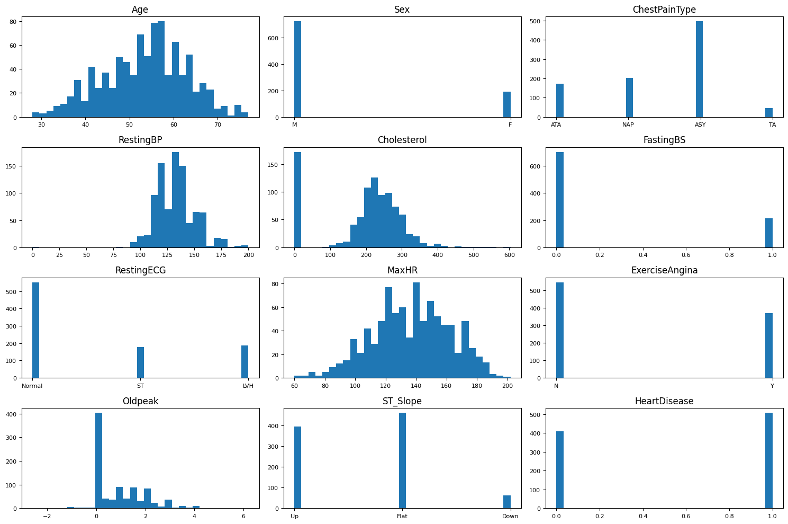
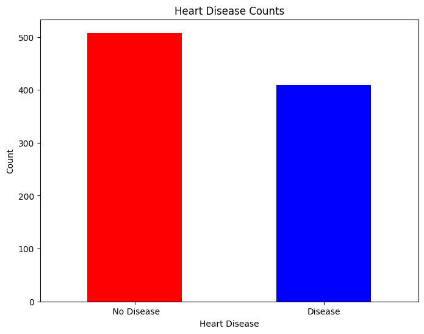
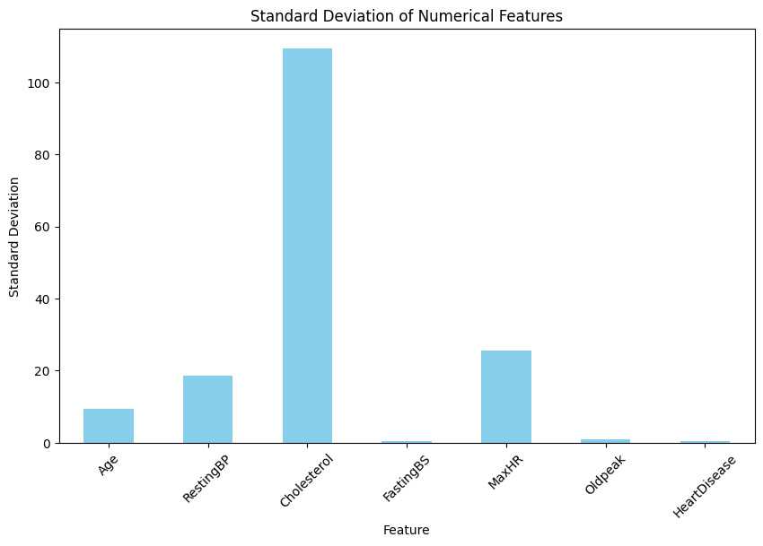
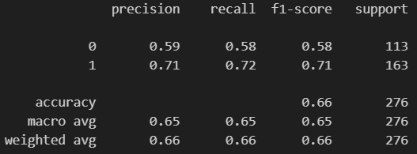
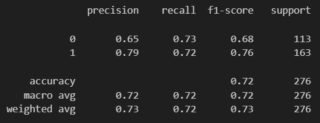
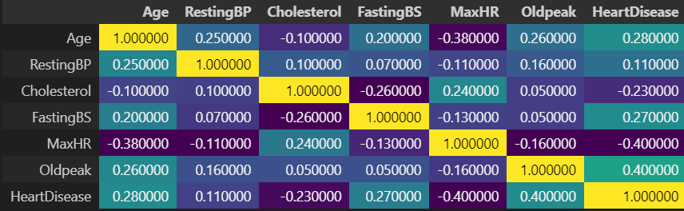
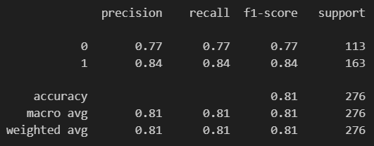
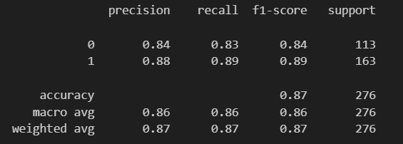
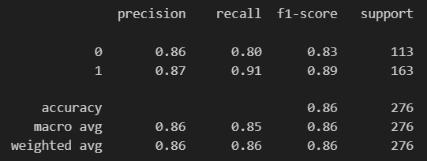
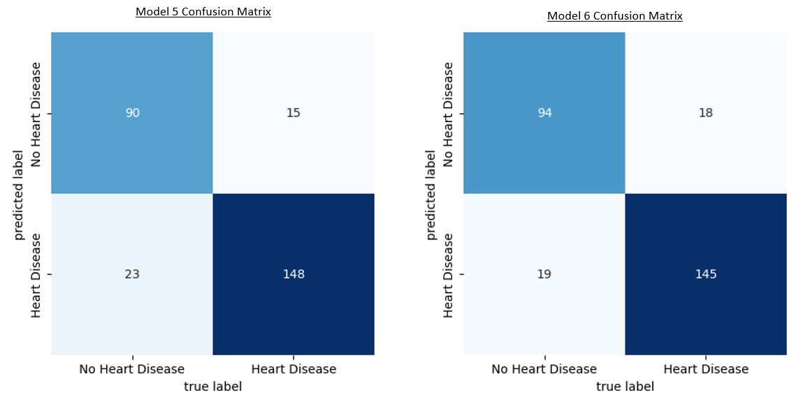

# ChangeLog

## Changes

### Collab Notebook
If you wish to experiment with the code, you can find the notebook on Google Collab at the link below.<br> 
[Collab Notebook - Heart Disease Prediction](https://colab.research.google.com/drive/1tFZy0fnmy0rkil1jTz4seG4am6N0_ic4?usp=drive_link)
<br>

### Project Goals
 The basis of this project is a notebook explaining the K Nearest Neighbours (KNN) algorithm. The goal of that notebook being  to give an overview of the K Nearest Neighbours machine learning algorithm by demonstrating its use in both classification and regression. The notebook completes a classification task regarding irises which inspired the project this notebook undertakes. That task is to apply the KNN algorithm to healthcare by attempted to predict the occurance of heart disease based on a number of patient variables. Please find a link [here](https://www.kaggle.com/code/mmdatainfo/k-nearest-neighbors) to the original notebook being followed for those interested.

### Data Source
<p> The source notebook retrieves the data it uses for its predictions from included datasets within the sklearn platform. This project instead sources its data from kaggle with the dataset described below:

1. **Heart Failure Prediction Dataset**
    - **Description**: This dataset was created for research purposes through the combination of 5 different health datasets with data drawn from a number of different countries. The dataset has 1190 instances each with 11 different patient health variables such as Age, Cholestoral, Resting Blood Pressure, etc. 
    - **Usage**: This dataset will be used to attempt to predict whether a patient will develop heart disease.
    - **Source Quality**: This dataset was sourced from Kaggle and has a high usability score from Kaggle users.
    - **Link**: [here](https://www.kaggle.com/datasets/fedesoriano/heart-failure-prediction)

### Data Exploration
<p> As this project is using a different dataset, some data exploration and preprocessing is required to make sure the data is clean and ready for modelling. The reference notebook uses the enumerate function in python to create variable distribution histogram showing the frequency that values appeared in each field of the dataset. This project adapted that function to produce a similar chart seen below.
</p>



These subplots provide a valuable visual insight into any imbalances in the dataset in terms of variable value distributions. Looking at this chart we can see where the dataset may introdcause issues when trained with this data.

1. **Target distribution**: There is a slight bias towards heart disease in the dataset with it occuring in 55% of cases and not occuring in 45% of cases. We must keep in mind as we train our algorithm that this imbalance exists and may skew our predictions towards heart disease. We created this graph to furhter highlight this.



2. **Other Imbalances**: By analysising the subplots we can also see large imbalances which could cause bias in our algorithm in Sex, Cholesterol and Oldpeak. When finetuning our algorithm we must keep in mind that these exist and may have to be mitigated to increase our algorithm accuracy on unseen data.

Further Data exploration under taken was to analysis the difference in feature variable ranges as this can also cause issues where variables with larger value ranges skew results due to the difference in variable value size. This was done by calculating the standard deviation with the following code.

```
f# Selecting numerical columns
numerical_cols = df.select_dtypes(include=['int64', 'float64']).columns

# Calculating range for each numerical column
range_values = df[numerical_cols].max() - df[numerical_cols].min()

# Calculating standard deviation for each numerical column
std_deviation = df[numerical_cols].std()

print("Range of values for each numerical feature:")
print(range_values)
print("\nStandard deviation of each numerical feature:")
print(std_deviation)
```


Looking at the chart we can see that Cholesterol is an outlier in terms of standard deviation. This means that it has the possibility to skew our predictions by overwhelming other features with smaller ranges of values. When finetuning this will have to be fixed by normalising all of these numerical columns.

### Data Preprocessing
The reference notebook uses a dataset which is cleaned and has only numerical features. This project's dataset feature both categorical and numerical features so some changes to the data preprocessing was required. This project first checks for null values. This check showed that there were no null values so the next step was to use OneHotEncoding on all categorical features. To complete this, a column transformer was created to perform the necessary column translation, the feature vector was encoded and the dataset was split into training and test sets.

```
one = OneHotEncoder()
column_trans = make_column_transformer(
    (one,['Sex', 'ChestPainType', 'RestingECG', 'ExerciseAngina', 'ST_Slope']),  
    remainder='passthrough'
)

X = column_trans.fit_transform(X)

from sklearn.model_selection import train_test_split
X_train, X_test, y_train, y_test = train_test_split(X, y, test_size=0.3, random_state=0)

```

### Model Creation

#### Model 1
The first K nearest neighbours model was a simple model created to get an idea of where improvements could be made. It used an arbitary k value of 3. 

```
knn = KNeighborsClassifier(n_neighbors=3)
knn.fit(X_train, y_train)

```
The k value is a hyperparameter which controls the number of nearest neighbours the algorithm uses to classify a new data point. 

#### Model Evaluation 
The results for the first model were as follows: 


We can see that the model does not perform very well particulary when predicting no heart disease. These results show that the imbalances in distribution and range of variables are probably affecting model performace.

#### Model 2
The next model attempts to increase accuracy by tuning the k value. Cross validation is used to check values between 1 and 50, to determine the best value for k.

```
parameters = {"n_neighbors": range(1, 50)}
gridsearch = GridSearchCV(KNeighborsClassifier(), parameters)
gridsearch.fit(X_train, y_train)
gridsearch.best_params_
```
#### Model Evaluation
The results for this model were as follows:

The optimal value of k was found to be 35. However, even though there was a small improvement, overall accuracy only reached 72% and the model still is performing poorly in its predictions of no heart disease. The next steps must be to look at our feature vector and try to tune it by removing imbalances in range and distribution of values across the dataset.

### Model 3

#### Feature Engineering

##### Correlation
The first step in this process was to use data analysis to deduce if some dimensions could potentially be dropped as they do not correlate with heart disease incidence. The correlation matrix below was created to analyse the feature vector.



This matrix shows that all features correlate to heart disease either positively or negatively. RestingBP shows the smallest correlation but it still does have some bearing on heart disease occurance. These results showed that no dimension could be removed.

##### Normalisation
In our data exploration we identified that the numerical columns showed large difference in terms of range of values. As such, the next step was to normalise all numerical columns to the range of 0 to 1. To do this a MinMaxScaler was used.

```
# Initialize MinMaxScaler
scaler = MinMaxScaler()

numerical_cols = X.select_dtypes(include=['int64', 'float64']).columns

# Normalize numerical columns
X[numerical_cols] = scaler.fit_transform(X[numerical_cols])
```

#### Model Evaluation



The previous model was then utilised again on the normalised dataset. The gridsearch this time selected a different k value of 47. We can see a large increase in performance by introduced column normalisation. This shows the impact that feature scale can have on model accuracy and the importance and utility of normalising data dimensions.

### Model 4
The next change was to try to utilise StandardsScaler on out numerical columns instead of normalisation. This preprocessor standardises features by removing the mean and scaling all features to have a standard deviation of 1.

```
# Initialize Scaler
scaler = StandardScaler()

numerical_cols = X.select_dtypes(include=['int64', 'float64']).columns

# Transorm numerical columns
X[numerical_cols] = scaler.fit_transform(X[numerical_cols])
```
#### Model Evaluation

This Scaling method showed a increase in performance from 81% to 87%. This result shows that StandardScaler works better on this dataset. This could be because StandardScaler is less sensitive to outliers in the data. Using the mean and standard deviation, reduces the chance of overfitting to noise/outliers in the data.

### Model 5
```
parameters = {
     "n_neighbors": range(1, 50),
     "weights": ["uniform", "distance"],
     "metric": ["euclidean","manhattan","minkowski"]
}
gridsearch = GridSearchCV(KNeighborsClassifier(), parameters)
gridsearch.fit(X_train, y_train)
gridsearch.best_params_
```
The next model developed in an attempt to increase accuracy was a model which used cross validation to attempt to tune two additional hyperparameters:
1. **Weights:** This parameter controls whether distance of neighbours is taken into account. It can be either:
- Uniform: Here all neighbours have an equal weight regardless of distance.
- Distance: With this setting the weight of each neigbour is proportional to its distance.
2. **Metric:** This parameter specifies which distance metric is used to calculate distance between datapoints. Metrics which were included in gridsearch were:
- Euclidean: This is the distance between two data points calculated as a straight line between data points.
- Manhatten: This is distance between two points calculates as a "city block" distance. This means the length of two lines horizontal and vertical between the two points, not diagonally.
- Minkowski: Minkowski distances is a generalisation of both Euclidean and Manhatten distance.

#### Model Evaluation


Model 6 illustrates the importance of looking beyond only the overall accuracy when evaluating model performance. If we compare Model 5's accuracy of 87 to Model 6's accuracy of 86, we may think Model 5 is the better model overall. However looking beyond accuracy let us compare the confusion matrix for both models.



Here we see while overall accuracy slightly decreased, the occurance of False negatives decreased with Model 6. Due to the fact that we are trying to predict whether a human has heart disease, minimising the occurence of False negatives as much as possible is very important. Therefore, although accuracy did decrease, in my opinion Model 6 is the best model to date due to it reducing False Negative occurences.

### Learning Outcomes
The completion of this project illustrated a number learning points for machine learning tasks:
1. **KNN hyperparameters**: Understanding and tuning hyperparameters such as the number of neighbors (n_neighbors), weights, and distance metric (metric) is crucial for optimizing the performance of the K-nearest neighbors algorithm.

2. **Feature Scale**: This project highlighted the importance of scaling features to a consistent range, demonstrating how different scaling methods like MinMaxScaler and StandardScaler can impact model performance.

3. **Feature distribution**: Exploring the distribution of features can provide insights into their relationships with the target variable and help in feature selection and engineering to improve model accuracy.

4. **SKLearn Scalers**: Using Scikit-learn's preprocessing scalers such as MinMaxScaler and StandardScaler enables standardization and normalization of feature values, facilitating better model convergence and performance.

5. **Different Distance Metrics**: Through experimentation with metrics such as Manhattan and Euclidean distances, I gained insight into how the choice of distance metric affects the behavior and performance of machine learning algorithms like K-nearest neighbors.

6. **Accuracy is not always the best metric**: While accuracy is commonly used to evaluate model performance, it's essential to consider other metrics like precision, recall, and F1-score, especially when dealing with a project where a certain error is more costly than others. In this project for example with the task being predicting disease in humans, False Negatives must be minimised as much as possible.
